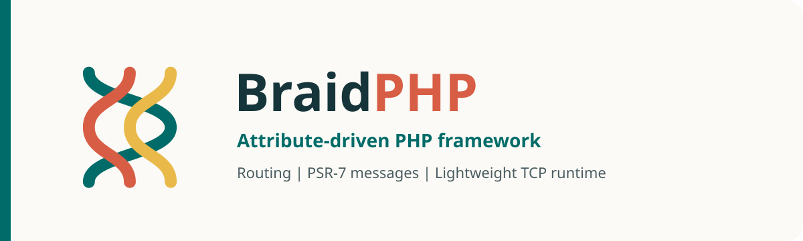

# BraidPHP



[![Latest Version on Packagist][badge-packagist-version]][packagist]
[![Monthly Downloads on Packagist][badge-packagist-downloads]][packagist]
[![Total Downloads on Packagist][badge-packagist-total-downloads]][packagist]
[![PHP Version Required][badge-php-version]][packagist]
[![License][badge-license]](LICENSE)
[![CI][badge-ci]][ci]
[![Codecov][badge-codecov]][codecov]
[![Open Issues][badge-issues]][issues]

BraidPHP is an attribute-driven PHP framework with a router and a lightweight
single-process TCP HTTP runtime. Dependency injection and PSR-11 storage are
provided by the standalone
[`dvictorjhg/php-injector`](https://github.com/dvictorjhg/php-injector) package.

The supported platform is PHP `^8.4`. The runtime is intentionally
single-process; scale it with a process manager, container platform, or reverse
proxy when the application needs more than one worker.

## Documentation

The [BraidPHP documentation page](https://dvictorjhg.github.io/braidphp/) is the visual entry point for
installation, modules, attribute routing, HTTP messages, the server runtime,
and the public API. It is a static page with relative assets under
`docs/assets`, and includes light/dark themes plus English and Spanish
translations.

This README is the copy-and-paste reference for the smallest working
application. The [changelog](CHANGELOG.md), [contribution guide](CONTRIBUTING.md),
and [security policy](SECURITY.md) complete the release documentation.

## Requirements

- PHP 8.4+
- Composer

## Installation

```bash
composer require dvictorjhg/braidphp
```

## Quick Start

Create a module with a router provider and a controller, then start the server:

```php
<?php

declare(strict_types=1);

use dvictorjhg\braidphp\Core\App;
use dvictorjhg\braidphp\Core\Attributes\Module;
use dvictorjhg\braidphp\Router\Attributes\Get;
use dvictorjhg\braidphp\Router\Attributes\Route;
use dvictorjhg\braidphp\Router\Http\Request;
use dvictorjhg\braidphp\Router\Router;
use dvictorjhg\braidphp\Router\HttpModule;

final class Greeter
{
    public function greeting(string $name): string
    {
        return "Hello $name!";
    }
}

#[Route(path: '/api')]
final class GreetingController
{
    public function __construct(private Greeter $greeter)
    {
    }

    #[Get('/hello/:name', pathMatch: 'full')]
    public function hello(Request $request): string
    {
        return $this->greeter->greeting($request->getRouteParam('name') ?? '');
    }
}

#[Module(
    imports: [HttpModule::class],
    providers: [Greeter::class],
    controllers: [GreetingController::class]
)]
final class AppModule
{
}

$app = new App();
$app->bootstrapModule(new AppModule());
$app->listen(address: '0.0.0.0', port: '8000');
```

With the server running, request `http://127.0.0.1:8000/api/hello/Ada`:

```text
Hello Ada!
```

The controller is discovered from attributes, `Greeter` is resolved by the
injector, and the `:name` path segment is available on the immutable request
copy passed to the action.

The front controller in [Example/index.php](Example/index.php) reads
`SERVER_ADDRESS` and `SERVER_PORT` from the environment.

## Run and Try the Example

From the repository root, install the dependencies and start the checked-in
example:

```bash
composer install
php Example/index.php
```

Leave the server running, open a second terminal, and try the routes exposed by
the example modules:

```bash
curl http://127.0.0.1:8000/api/hello/Ada
# Hello Ada!

curl 'http://127.0.0.1:8000/api/hello?name=Ada'
# Hello Ada!

curl -X POST http://127.0.0.1:8000/api/hi/Ada
# Hi Ada!

curl http://127.0.0.1:8000/health/status
# ok
```

Stop the server with `Ctrl+C` when you are finished.

## Modules

`#[Module]` is the composition boundary for an application. Each argument is
optional and accepts an array or a `PHPInjector\Container\Container`:

| Argument | Purpose |
| --- | --- |
| `imports` | Bootstrap other module classes or module objects first. |
| `providers` | Register classes, values, aliases, or factories with the injector. |
| `controllers` | Scan classes or objects for route attributes. |
| `bootstrap` | Resolve keyed classes after providers and controllers are ready. Existing objects are kept as-is. |

The checked-in [Example](Example) uses one root module to load the HTTP module
and two feature modules. `GreeterModule` imports `GreeterProviderModule`, so its
controller consumes a provider registered by another module:

```php
use dvictorjhg\braidphp\Core\Attributes\Module;
use dvictorjhg\braidphp\Router\HttpModule;

#[Module(
    imports: [
        HttpModule::class,
        GreeterModule::class,
        HealthModule::class,
    ],
)]
final class AppModule
{
}

#[Module(
    imports: [GreeterProviderModule::class],
    controllers: [GreeterComponent::class],
)]
final class GreeterModule
{
}

#[Module(
    providers: [GreeterProvider::class],
)]
final class GreeterProviderModule
{
}

#[Module(
    providers: [HealthProvider::class],
    controllers: [HealthComponent::class],
)]
final class HealthModule
{
}
```

`App::bootstrapModule()` loads each imported module before processing the
importing module's own entries. `HttpModule` provides `Router::class`, and
`GreeterProviderModule` provides `GreeterProvider` to `GreeterComponent` through
`GreeterModule`. The feature modules contribute their route controllers.
Provider values and classes use the same resolution rules as the standalone
[`php-injector`](https://github.com/dvictorjhg/php-injector) package.

### One route, two valid declarations

The `#[Get]` shortcut and the generic `#[Route]` attribute below produce the
same `GET /api/hello/Ada` response. Choose one declaration style for a route.

**Shortcut attribute:**

```php
use dvictorjhg\braidphp\Router\Attributes\Get;
use dvictorjhg\braidphp\Router\Attributes\Route;
use dvictorjhg\braidphp\Router\Http\Request;

#[Route(path: '/api')]
final class GreetingController
{
    #[Get('/hello/:name', pathMatch: 'full')]
    public function hello(Request $request): string
    {
        return 'Hello ' . ($request->getRouteParam('name') ?? '') . '!';
    }
}
```

**Generic attribute:**

```php
use dvictorjhg\braidphp\Router\Attributes\Route;
use dvictorjhg\braidphp\Router\Http\HttpMethod;
use dvictorjhg\braidphp\Router\Http\Request;

#[Route(path: '/api')]
final class GreetingController
{
    #[Route(
        httpMethod: HttpMethod::GET,
        path: '/hello/:name',
        pathMatch: 'full',
    )]
    public function hello(Request $request): string
    {
        return 'Hello ' . ($request->getRouteParam('name') ?? '') . '!';
    }
}
```

Both forms return:

```text
GET /api/hello/Ada
Hello Ada!
```

Do not stack both attributes on the same method. That describes the same
method and path twice, so the scanner creates duplicate route entries and
makes route precedence harder to reason about:

```php
#[Get('/hello/:name', pathMatch: 'full')]
#[Route(
    httpMethod: HttpMethod::GET,
    path: '/hello/:name',
    pathMatch: 'full',
)]
public function hello(Request $request): string
{
    return 'Hello ' . ($request->getRouteParam('name') ?? '') . '!';
}
```

## Routing

Routes are declared with `#[Route]` or one of the method-specific attributes:
`#[Get]`, `#[Head]`, `#[Post]`, `#[Put]`, `#[Delete]`, `#[Connect]`,
`#[Options]`, `#[Trace]`, and `#[Patch]`.

- A class route is a prefix for its method routes.
- A `:name` segment captures a path parameter, available through
    `Request::getRouteParam()` or `Request::getRouteParams()`.
- Query strings are parsed into `Request::getQueryParams()`.
- `pathMatch: 'prefix'` is the default for route nodes; `pathMatch: 'full'`
    requires the route path to consume the complete path at that level.
- Programmatic `Route` objects can use a custom matcher that returns
    `UrlMatcherResult` or `null`. A path and matcher cannot be used together.
- `HttpMethod` values can be combined with bitwise OR when a route accepts
    more than one method, for example
    `HttpMethod::GET->value | HttpMethod::POST->value`.

`Router::processRoutes()` returns a `RouteMatch` containing the selected route
and captured parameters. `App::handleRequest()` applies those parameters to a
request copy before it invokes the action.

## HTTP Messages

`Request`, `Response`, `Uri`, and `Stream` implement the relevant PSR message
contracts. Message and URI `with*()` methods return a new instance when a
value changes:

```php
use dvictorjhg\braidphp\Router\Http\Request;

$request = new Request(method: 'GET', uri: '/health');
$withTrace = $request->withHeader('X-Trace', 'request-1');
$withMoreTrace = $withTrace->withAddedHeader('X-Trace', 'request-2');

echo $request->hasHeader('X-Trace') ? 'changed' : 'original';
echo $withMoreTrace->getHeaderLine('x-trace');
```

Headers are case-insensitive and support multiple string values. Request bodies
and response bodies are streams; `Stream::of()` accepts scalar content,
resources, stringable objects, and existing PSR streams. `Response` supplies a
known reason phrase when one is available. During string serialization it adds
`Content-Type: text/plain` and calculates `Content-Length` when those headers
were not supplied.

## Runtime and Errors

`App::listen()` opens a TCP socket and handles requests in a blocking,
single-process loop. The front controller reads `SERVER_ADDRESS` and
`SERVER_PORT`; both default to `0.0.0.0` and `8000` when they are not set.

`App::handleRequest()` returns a `404 Not Found` response when no route matches.
String, scalar, `null`, and supported object results from actions become `200`
responses; actions may return `Response` directly for full control. Unsupported
results or routing/application failures raise framework exceptions. The socket
loop catches uncaught throwables and writes a `500` response containing the
server error message.

## Structure

```text
bin/       Container launchers
docs/      Static documentation
docker/    PHP container definitions
Example/   Example application
    index.php       Application entry point
    AppModule.php   Root module
    Modules/        Module composition
    Controllers/    Route components
    Providers/      Injectable services
src/       Framework source
tests/     Unit and integration tests
```

## Quality

The main CI workflow in [.github/workflows/ci.yml](.github/workflows/ci.yml)
uses [GitHub Actions](https://github.com/features/actions) on PHP 8.4 and 8.5
to validate [Composer](https://getcomposer.org/) metadata and platform
requirements, run [PHPStan](https://phpstan.org/) and
[PHP_CodeSniffer](https://github.com/PHPCSStandards/PHP_CodeSniffer), execute
the [PHPUnit](https://phpunit.de/) suite with
[Xdebug](https://xdebug.org/) coverage enabled, publish the Clover report to
[Codecov](https://codecov.io/gh/dvictorjhg/braidphp), and fail the build if
statement coverage drops below 50%.

Before the first upload, enable the repository in Codecov. Public pull requests
from forks can upload from an unprotected branch without a token, but uploads
for protected branches and all private repositories require a Codecov token
unless token authentication for public repositories has been disabled in
Codecov's **Global Upload Token** settings. For the reliable protected-branch
path, add the repository token as a GitHub Actions secret named
`CODECOV_TOKEN` under **Settings > Secrets and variables > Actions**. Keep it in
GitHub Secrets rather than committing it to the repository.

## Tooling

- [GitHub Actions](https://github.com/features/actions) for continuous integration, with [actions/checkout](https://github.com/actions/checkout) and [shivammathur/setup-php](https://github.com/shivammathur/setup-php) for supported PHP runtimes.
- [Codecov](https://codecov.io/gh/dvictorjhg/braidphp) for coverage reports and the README badge, uploaded through [codecov/codecov-action](https://github.com/codecov/codecov-action).
- [Composer](https://getcomposer.org/) for dependency management, package metadata validation, and project scripts.
- [PHPStan](https://phpstan.org/) for static analysis, executed through `composer analyse`.
- [PHP_CodeSniffer](https://github.com/PHPCSStandards/PHP_CodeSniffer) for coding standards, executed through `composer check-style`.
- [PHPUnit](https://phpunit.de/) and [Xdebug](https://xdebug.org/) for tests and coverage reports.
- [tools/check-coverage.php](tools/check-coverage.php) for enforcing the minimum 50% statement coverage threshold from Clover XML.

## Development

```bash
composer install
composer validate --strict
composer check-platform-reqs
composer analyse
composer check-style
composer test
```

To run the same coverage checks enforced in CI:

```bash
composer test:coverage
composer coverage:check
```

The Docker image uses PHP 8.5.9. To run the development container with Podman
on Windows:

```powershell
./bin/podman-run.ps1 -Environment development -Detach
podman exec braidphp-development composer test
./bin/podman-run.ps1 -Action down
```

Use [bin/podman-run.sh](bin/podman-run.sh) for Unix-like shells. Both launchers
read `.env`, build the selected image, expose `SERVER_PORT`, and mount source
directories in development mode.

## Changelog

See [CHANGELOG.md](CHANGELOG.md) for the current release notes.

## Contributing

See [CONTRIBUTING.md](CONTRIBUTING.md) and
[CODE_OF_CONDUCT.md](CODE_OF_CONDUCT.md) for contribution guidelines. The
[AI use policy](AI_USE_POLICY.md) explains attribution expectations for
generated material.

## Security

See [SECURITY.md](SECURITY.md) for private vulnerability reporting. Do not
open a public issue for a security vulnerability.

## Release / Publishing

For a release, update [CHANGELOG.md](CHANGELOG.md), validate the package with
`composer validate --strict`, `composer analyse`, `composer test`, and the
coverage checks, then create and push an annotated Git tag such as `1.0.2`.

After the tag is on GitHub, publish a GitHub Release and refresh the package on
Packagist. Verify that users can install the package with
`composer require dvictorjhg/braidphp:^1.0`.

## License And Attribution

BraidPHP is released under the [Apache License 2.0](LICENSE). For
redistribution, preserve the license text, repository copyright, and
attribution notices. The supplemental
[NOTICE](NOTICE) and [CITATION.cff](CITATION.cff) files record the project
attribution and citation details.

For academic, professional, blog, package, or product reuse, keep attribution
intact and link back to the original repository when reasonable.

## AI Use Policy

The maintainer wants this project credited when it is reused and does not want
it stripped of attribution or turned into low-quality AI-generated derivative
spam. That expectation is documented in [AI_USE_POLICY.md](AI_USE_POLICY.md).

The policy is project guidance, not an additional open-source restriction. If
you need enforceable no-AI or no-training terms, a source-available
non-open-source license would be required.

[badge-packagist-version]: https://img.shields.io/packagist/v/dvictorjhg/braidphp.svg?style=flat-square
[badge-packagist-downloads]: https://img.shields.io/packagist/dm/dvictorjhg/braidphp.svg?style=flat-square
[badge-packagist-total-downloads]: https://img.shields.io/packagist/dt/dvictorjhg/braidphp.svg?style=flat-square
[badge-php-version]: https://img.shields.io/packagist/php-v/dvictorjhg/braidphp.svg?style=flat-square
[badge-license]: https://img.shields.io/packagist/l/dvictorjhg/braidphp.svg?style=flat-square
[badge-ci]: https://github.com/dvictorjhg/braidphp/actions/workflows/ci.yml/badge.svg?branch=main
[badge-codecov]: https://codecov.io/gh/dvictorjhg/braidphp/branch/main/graph/badge.svg
[badge-issues]: https://img.shields.io/github/issues/dvictorjhg/braidphp.svg?style=flat-square
[packagist]: https://packagist.org/packages/dvictorjhg/braidphp
[ci]: https://github.com/dvictorjhg/braidphp/actions/workflows/ci.yml
[codecov]: https://codecov.io/gh/dvictorjhg/braidphp
[issues]: https://github.com/dvictorjhg/braidphp/issues
